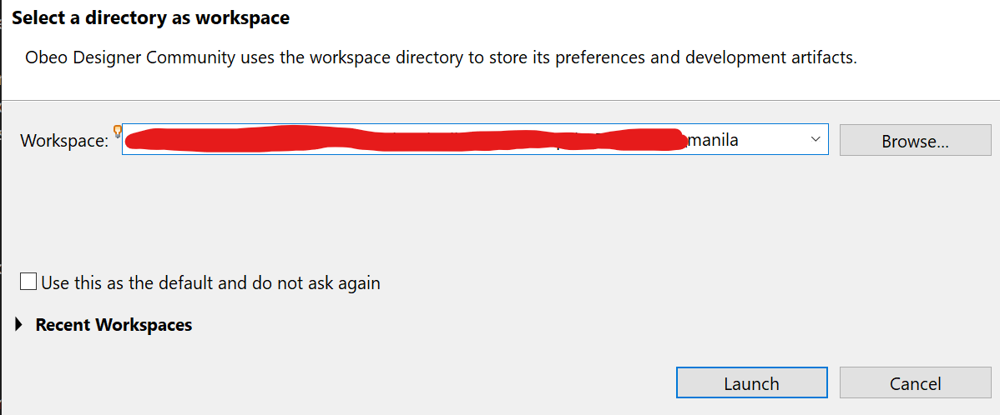
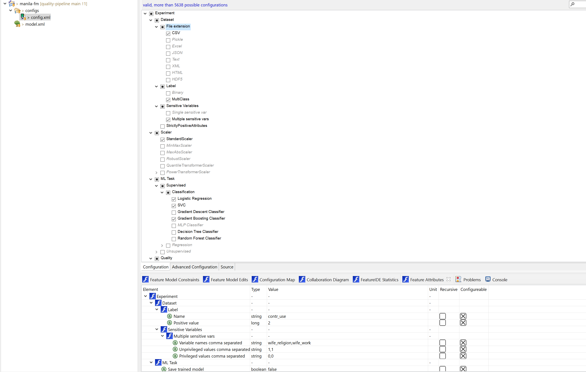

# MANILA Framework

[](https://www.gnu.org/licenses/agpl-3.0)

[](https://doi.org/10.5281/zenodo.7523351)


This repository cointains the source code of the _MANILA_ framework described in the paper _Democratizing Quality-Based Machine Learning Development through Extended Feature Models_.

## Project Structure

This project is structured in the following way:

- **gen**: this folder contains the generated files of the experiment workflow
- **generator**: this folder contains all the files needed to generate an experiment workflow
  - **templates**: this folder contains all the Jinja templates used to generate the needed files
  - **generator.py**: main file to generate the experiment workflow
- **manila-fm**: this folder contains the implemented Extended Feature Model and the relative configuration specifications
  - **configs**: directory in which the configuration files are stored
  - **feature-model.png**: full picture of the Extended Feature Model
  - **model.xml**: specification of the Extended Feature Model
- **ris**: this directory contains the results of the experiment's execution
  - **model.pkl**: is the fully trained model returned by the experiment
  - **report.csv**: report of all the metrics computed during the experiment
- **test_data**: this folder contains the dataset used in the proof of concept

## Experiment reproduction

Please follow these steps to reproduce the Proof of Concept described in the paper.

### Environment setup

1. Install FeatureIDE following the instructions reported at the following [link](https://featureide.github.io/#download)
2. Install Miniconda following the instructions reported at the following [link](https://docs.conda.io/en/latest/miniconda.html#)
3. Create a new conda environment and install the Jinja package using these commands:

```shell
$ conda create -n manila_env python=3.9
$ conda activate manila_env
$ pip install Jinja2
```

### Proof of concept

1. Start Eclipse and select the root folder as workspace:



2. From the opened window click of _File_ -> _Import_ -> _Existing Project into Workspace_, select the root folder as the root directory and `manila-fm` should appear among the projects:


3. Click on Finish and the project should appear on the left panel:


4. Click on the `model.xml` file to open the Extended Feature Model:


5. Open the `config.xml` file to see the defined configuration of the experiment:



6. From the root folder call the generator file with the following command:

```shell
$ conda activate manila_env
$ python generator/generator.py -n manila-fm/configs/config.xml
```

7. Create the required environment and execute the generated experiment with the following commands:

```shell
$ conda env create -f gen/environment.yml
$ conda activate base_env
$ python gen/main.py -d test_data/cmc.csv
```

8. See the results in the `ris` folder


## License

This work is distributed under AGPL v3 License
